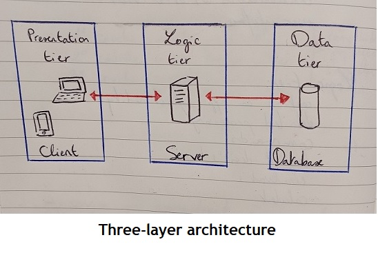

# The Architecture of Ornis

Ornis will have a multilayer architecture.

## A Three-layer Architecture

### Presentation Layer

The presentation layer is the **user interface**. It displays information to the user and collects information from the user.

### Logic Layer

Also known as the application layer or the middle layer, the logic layer controls the service's functionalities. It deals with logical decisions, evaluations and calculations.
This is where **data is processed.**

### Data Layer

The data layer is where **information is stored and retrieved**.

## A Single Page Application

Ornis is a SPA. 

It means it has only one HTML file (which will hold the app skeleton), components, and a routing system. It allows the separation of concerns, the externalization of static messages, and string interpolation.
I chose the SPA format for Ornis because it corresponds better to the users' needs. Indeed, the users will want the page to load rapidly and to access easily to the different features. On the developers' end, the SPA format has the advantage of being simple to maintain.

## Modules
 
Single-page applications are packaged up into modules. It is a way to organize our code. A module exports itself and import other modules. It is the way to use several composants where we want. The module defines a namespace. If there are similare names in differents modules, we can use them without conflicts. For example, if there are lots of functions in a module, we can select the fragments that we want to use.
