# Graphic Charter

# Kingfisher-inspired colour scheme

## Current palette

Ornis's colour scheme is inspired by the kingfisher, a colourful bird species found in Ile-de-France:

Teal: #2D5958

Turquoise: #00C9CA

Cream: #F1F1E6

Orange: #FF864A

From the larger palette underneath, I got this simpler palette using [mycolor.space](https://mycolor.space/):

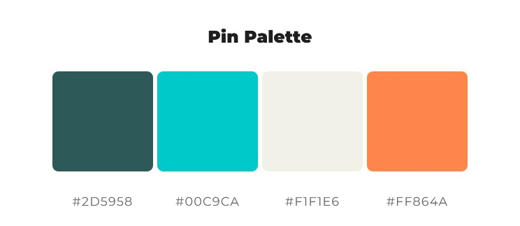

The teal, turquoise and orange of kingfishers remain, with more harmony than the former palette. I'll use a variant of the cream colour for the background, or white.

### Palette colour variants

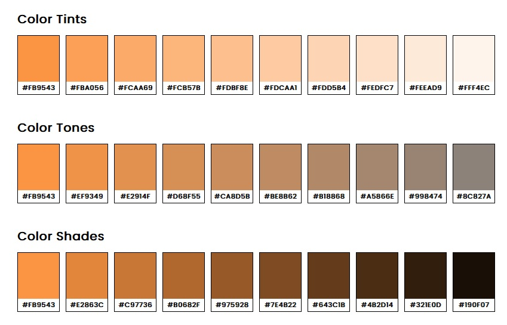

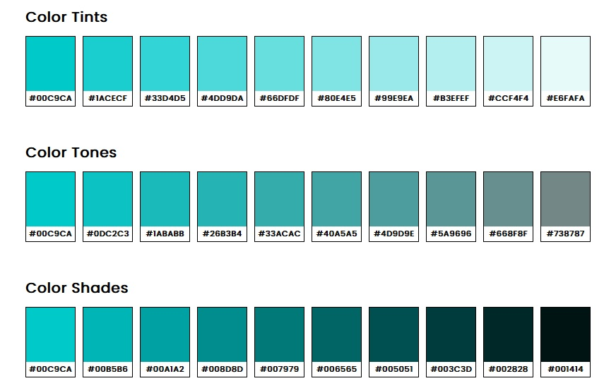

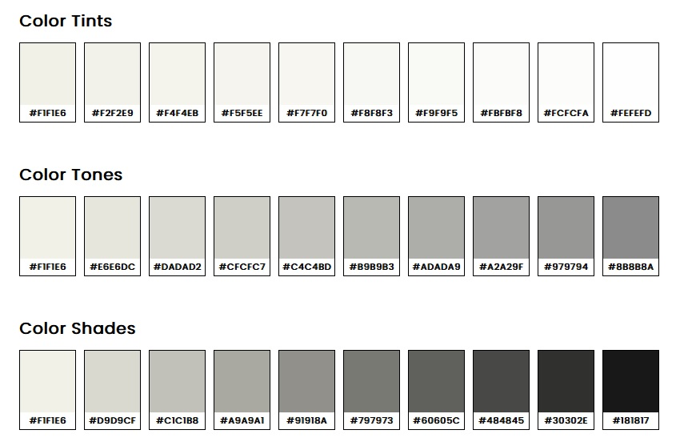

## Colour scheme accessibility

### Colourblindness test

Using [Adobe Color](https://color.adobe.com), I tested this palette for accessibility. This is the result of the simulation of the different types of colourblindness:

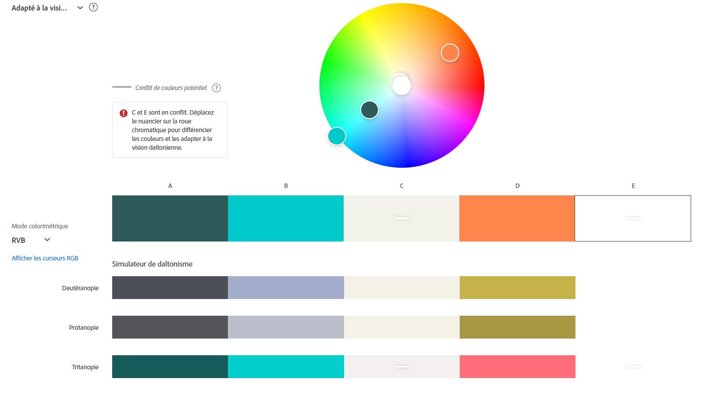

Because the website asked for 5 different colours to create a palette, I put white as a last colour. This is the reason there is a flag for colour conflict, between the white and the cream colours.

With the tests I realized white would be a better choice than cream for my colour palette so cream will not be used. Hence, there will be no colour conflict.

### Contrast tests:

- For a cream background with teal text: [passes]

- For a cream background with turquoise text: [fails]

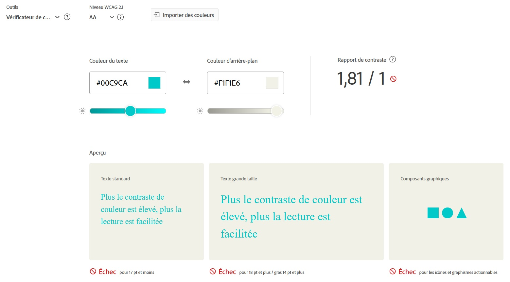

- For a cream background with orange text: [fails]

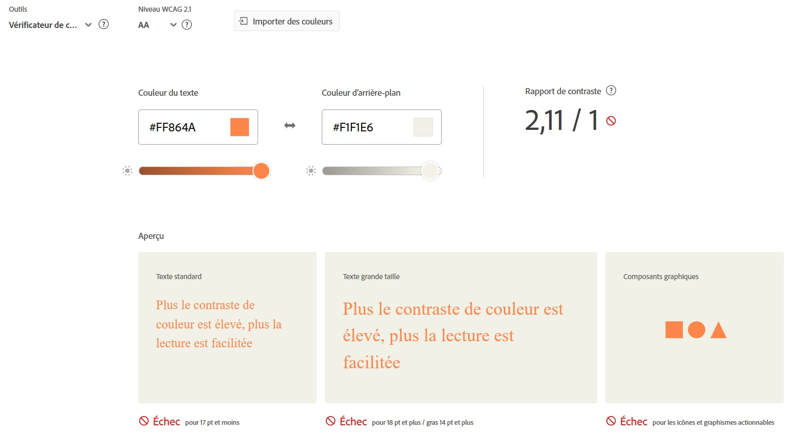

- For an orange background with teal text: [passes partially]

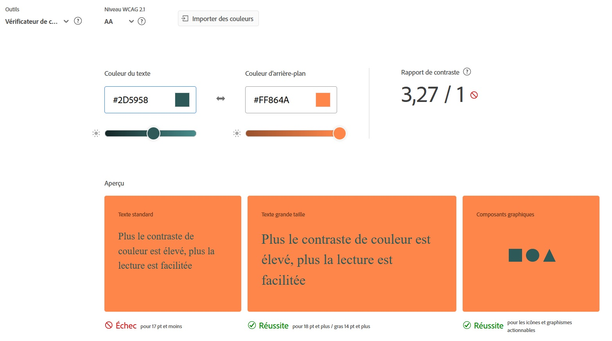

- For a teal background with orange text: [passes partially]

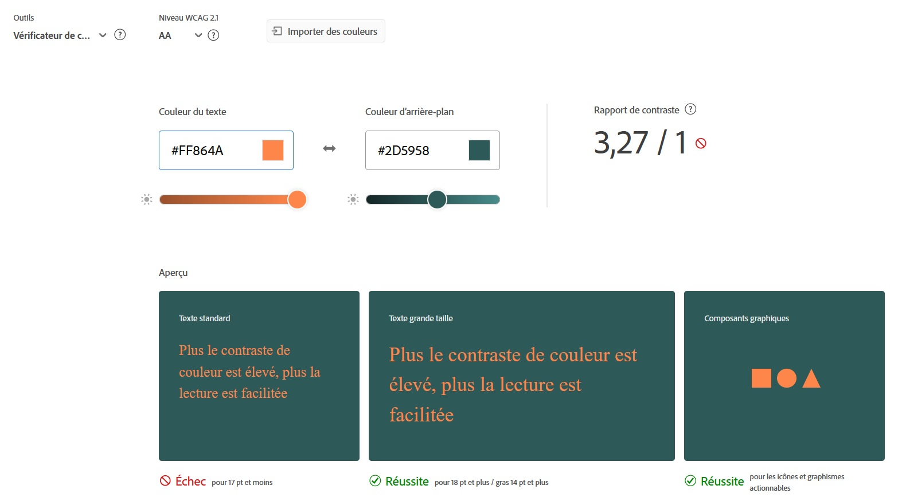

- For a teal background with turquoise text: [passes partially]

- For a turquoise background with teal text: [passes partially]

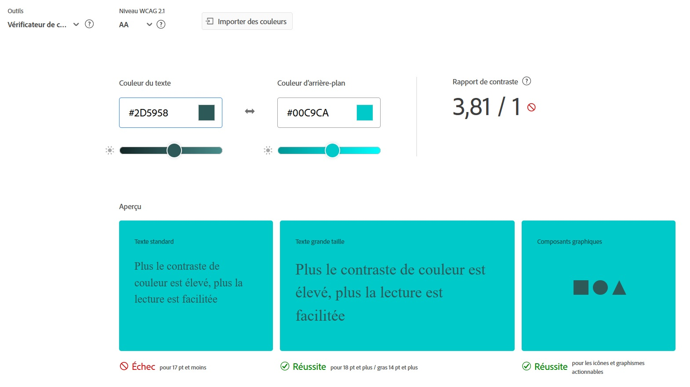

- Orange vs turquoise tests fail in both ways, these two colours should not be associated.

These tests made me realise a cream background undermined how popping the colours were and gave an old school look, almost paper-like, to the app. This is not the look that would appeal to the app's users. Therefore I am not going to use it for the background, I'll use white itsead. It will provide sharper contrast and a more current look.

## Thought process in the creation of this colour scheme

### Symbolism

Kingfisher's colours are relevant to Ornis because:

- Green represents environmental consciousness

- Yellow and orange are joyful, cheerful, optimistic colours

- Blue and green are associated with nature

Therefore they help convey emotions I want to convey with Ornis too. This app should be associated with fun and with nature, because it is supposed to be used leisurely, on walks or when hiking for instance, and it relates to fauna awareness, respect and protection.

### Former palette

This was the former palette:

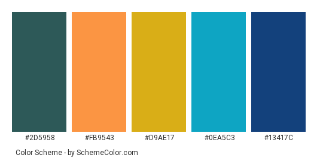

[Find various shades on schemecolor.com](https://www.schemecolor.com/kingfisher-bird.php).

I might make this graphic charter evolve into three main colours, a green, a mix between this yellow and orange, and a mix between these two blue.

Colour theory must also be applied for the choice of colours to have an harmonious colour scheme, pleasing to the eye.

### Creating a distinctive user interface

I had thought of creating a palette with green tones mainly, as they are associated with environment and nature, but this is the colour scheme of an already existing bird identification app ([Merlin Bird ID](https://github.com/LaurineDaSilva/ornis/wiki/Benchmark#merlin-bird-id)).

Also the pop colours of the kingfisher correspond better to the public I want to target with this app and with the purpose of this app.

# The font choice

## Thought process in the font choice

### Font accessibility

To make Ornis accessible to people with dyslexia, I looked into accessible fonts.

Some fonts, such as [OpenDyslexic](https://opendyslexic.org/), have been conceived especially for this purpose. However, they are pretty unusual and do not correspond to current general preferences in fonts and design in general.

Other fonts provide a good compromise between accessibility and design trends. From this [article](https://dyslexiahelp.umich.edu/sites/default/files/good_fonts_for_dyslexia_study.pdf), Helvetica, Courier, Arial, Verdana and CMU are good fonts for people with dyslexia.
