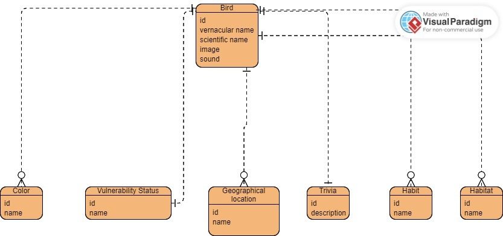

# Needs Analysis

## Data Model

## Bird entity

## Data Dictionary

### Bird list display

- In database:

| Conceptual Name | Generic Data Type | Management Rules                                             |
| --------------- | ----------------- | ------------------------------------------------------------ |
| Species code    | TEXT              | required, alphanum, length [1, 100], unique for a given bird |
| Scientific name | TEXT              | required, alphanum, length [1, 100], unique for a given bird |

- In JSON (i18n):

| Conceptual Name | Generic Data Type | Management Rules                                             |
| --------------- | ----------------- | ------------------------------------------------------------ |
| Species code    | TEXT              | required, alphanum, length [1, 100], unique for a given bird |
| Vernacular name | TEXT              | required, alphanum, length [1, 100], unique for a given bird |

- In front-end's images folder:

| Conceptual Name | Generic Data Type | Management Rules                                             |
| --------------- | ----------------- | ------------------------------------------------------------ |
| Image URL       | TEXT              | required, alphanum, length [1, 255], unique for a given bird |
