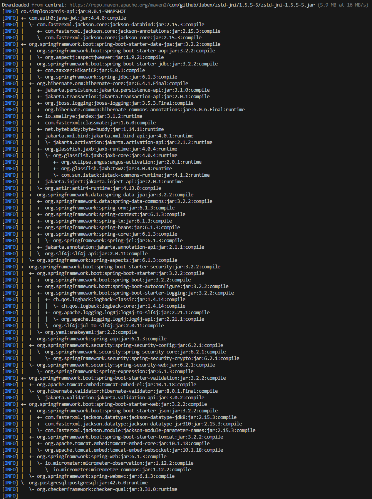

# [Maven dependency management](https://maven.apache.org/guides/introduction/introduction-to-dependency-mechanism.html)

Dependency management is a core feature of Maven. Managing dependencies for a single project is easy. Managing dependencies for multi-module projects and applications that consist of hundreds of modules is possible. Maven helps a great deal in defining, creating, and maintaining reproducible builds with well-defined classpaths and library versions.

## Dependency tree

This goal is used to view the dependency hierarchy of the project currently being built. It will output the resolved tree of dependencies that the Maven build process actually uses.

This goal can be executed from the command line: `mvn dependency:tree`

## Dependency scope

Dependency scope is used to limit the transitivity of a dependency and to determine when a dependency is included in a classpath.

6 scopes:

- `compile` (default scope)
- `provided` much like `compile`, but indicates you expect the JDK or a container to provide the dependency at runtime.
- `runtime` (dependency not required for compilation, but required for execution)
- `test`the dependency is not required for normal use of the application, and is only available for the test compilation and execution phases.
- the dependency is not required for normal use of the application, and is only available for the test compilation and execution phases.
- `system` This scope is similar to `provided` except that you have to provide the JAR which contains it explicitly.
- `import` This scope is only supported on a dependency of type pom in the `<dependencyManagement>` section. It indicates the dependency is to be replaced with the effective list of dependencies in the specified POM's `<dependencyManagement>` section. Since they are replaced, dependencies with a scope of import do not actually participate in limiting the transitivity of a dependency.

## Not declaring the version of a dependency in the pom.xml

**Dependency mediation** - this determines what version of an artifact will be chosen when multiple versions are encountered as dependencies. **Maven picks the "nearest definition"**. That is, it uses the version of the closest dependency to your project in the tree of dependencies. **You can always guarantee a version by declaring it explicitly in your project's POM**. Note that if two dependency versions are at the same depth in the dependency tree, the first declaration wins.

## Display dependency updates

`mvn versions:display-dependency-updates`

It shows the available updates for all dependencies, even those that are not in our own POM but in the parent POM.

## Update dependencies

`mvn versions: use-latest-versions`
