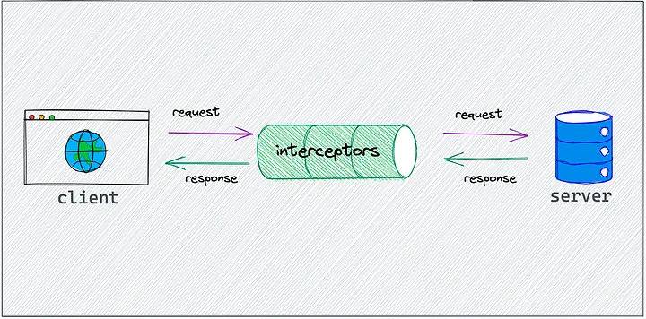

# Axios

Axios allows us to do HTTP requests. It has shortened functions for GET, PUT etc compared to Fetch.

Axios's base url is set with only one environment variable for the whole application. It means we don't need to duplicate this piece of code, we can stay DRY.

Another benefit is that we write much less code.

Axios is not framework-dependant, it can be used with VueJS, Angular, React...

## Key features

- Make XMLHttpRequests from the browser
- Make http requests from node.js
- Supports the Promise API
- **Intercept request and response**
- **Transform request and response data**
- Cancel requests
- Timeouts
- Query parameters serialization with support for nested entries
- Automatic request body serialization to:
  - JSON (application/json)
  - Multipart / FormData (multipart/form-data)
  - URL encoded form (application/x-www-form-urlencoded)
- Posting HTML forms as JSON
- Automatic JSON data handling in response
- Progress capturing for browsers and node.js with extra info (speed rate, remaining time)
- Setting bandwidth limits for node.js
- Compatible with spec-compliant FormData and Blob (including node.js)
- Client side support for protecting against XSRF

## Setting up environment variables for Axios

We export the Axios instance so that it can be used throughout the app, with globalProperties:

`app.config.globalProperties.$axios = _instance_`

We also need to set the base URL for the HTTP requests made with Axios.

`import axios from 'axios'`

`const instance = axios.create({`
`baseURL : "http://localhost:8080"`
`})`

`app.config.globalProperties.$axios = instance;`

Here, the base URL is hard coded in the code. We need to extract it for there with Vite and environment variables.

## `validateStatus`

We can define the HTTP codes that should throw an error.

[On this page of the official doc](https://axios-http.com/docs/req_config) accepted response statuses are from the range from 200 to 300.

[On this other page of the official doc](https://axios-http.com/docs/handling_errors) they are < 500, so client errors are not handled by Axios.

## Interceptors

[Interceptor explanation on _Medium_ (source for this schema), last accessed Feb 4th, 2024](https://medium.com/@barisberkemalkoc/axios-interceptor-intelligent-db46653b7303)

Axios interceptors are middleware functions that allow you to tap into the request and response flows. They offer a gateway to modify, authenticate, or handle errors at a centralized level.

Useful for centralizing behaviour for authentication tokens for instance.

Also helpful for error handling instead of catch blocks.

Can optimize requests.

Can refresh tokens.
