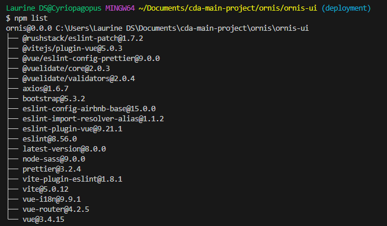

# npm

npm is a package manager for JavaScript in a Node.js runtime environment.

The available commands you can run in a project using npm are stored in the project's `package.json`, in the "script" object.
Developer can create and add their own npm commands.

## `npm install` vs `npm ci` (npm clean install)

`npm ci` is is an in-place replacement for npm install with two major differences:

- It does a clean install: if the `node_modules` folder exists, npm deletes it and installs a fresh one.
- It checks for consistency: if `package-lock.json` doesn’t exist or if it doesn’t match the contents of `package.json`, npm stops with an error.
  Think of `npm ci` as a stricter version of `npm install`, one that doesn’t accept inconsistencies of any kind (it would have flagged the mistake I made earlier).

`npm ci` is similar to `npm install`, except it's meant to be used in automated environments such as test platforms, continuous integration, and deployment -- or any situation where you want to make sure you're doing a clean install of your dependencies.

While in development, it's ok to use `npm install`, but once an app is deployed it's safer to use `npm ci`.

The main differences between using `npm install` and `npm ci` are:

- The project must have an existing `package-lock.json` or `npm-shrinkwrap.json`
- If dependencies in the package lock do not match those in `package.json`, npm ci will exit with an error, instead of updating the package lock.
- `npm ci` can only install entire projects at a time: individual dependencies cannot be added with this command.
- If a `node_modules` is already present, it will be automatically removed before `npm ci` begins its install.
- It will never write to `package.json` or any of the package-locks: installs are essentially frozen.

## `npm list`

`npm list` lists the installed packages of the current project.

## `npm outdated` and `npm update`

`npm outdated` lists outdated packages of the current project. It also shows the latest version number of the packages that is still compatible with the current configuration of the project (minor and patch release numbers), as well as the most recent version number of the packages, which would introduce breaking changes (major release numbers).

For patch and minor release numbers, it is possible to update the packages using `npm update`.

For major release numbers, we must update the packages manually and deal with each possible incompatibility.
