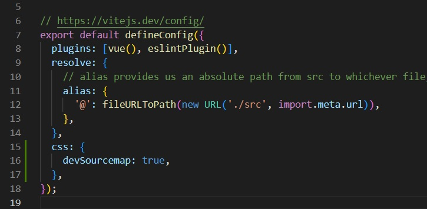
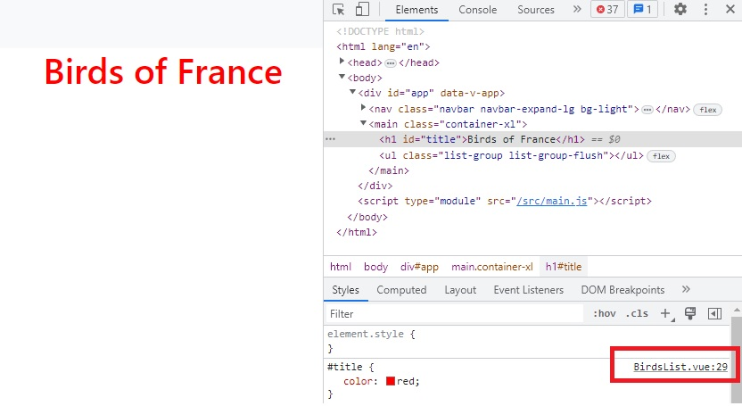

# Front-end Structure

As Ornis is a [SPA](https://github.com/LaurineDaSilva/ornis/wiki/Architecture#a-single-page-application), it will have only one HTML file, named index.html.
The app will have several components written in JavaScript and styled in CSS, as well as a routing system which will allow the rendering of the desired components.

Strings will be externalized, which means that they will not be hard coded in the HTML file, but will be rendered through JavaScript files and/or accessed from a JSON file. It will allow the app to be dynamic and it will improve the maintainability of the service.

Indeed, we will have a specific JSON file in which we will find all our labels. This will help us because when one label needs to be changed, we'll be able to look for it in a single file instead of many.

This approach will also make i18n easier if needed. For instance we will have one JSON file per supported language, which would help for the traduction of the app depending on the user's browser if we publish the app in several languages.

# Vue.js

Vue.js is a JavaScript open-source framework to build user interfaces and SPAs. It focuses on declarative rendering and component composition.

# npm

npm is a package manager for JavaScript in a Node.js runtime environment.

The available commands you can run in a project using npm are stored in the project's `package.json`, in the "script" object.
Developer can create and add their own npm commands.

## `npm install` vs `npm ci` (npm clean install)

`npm ci` is is an in-place replacement for npm install with two major differences:

- It does a clean install: if the `node_modules` folder exists, npm deletes it and installs a fresh one.
- It checks for consistency: if `package-lock.json` doesn’t exist or if it doesn’t match the contents of `package.json`, npm stops with an error.
  Think of `npm ci` as a stricter version of `npm install`, one that doesn’t accept inconsistencies of any kind (it would have flagged the mistake I made earlier).

`npm ci` is similar to `npm install`, except it's meant to be used in automated environments such as test platforms, continuous integration, and deployment -- or any situation where you want to make sure you're doing a clean install of your dependencies.

The main differences between using `npm install` and `npm ci` are:

- The project must have an existing `package-lock.json` or `npm-shrinkwrap.json`
- If dependencies in the package lock do not match those in `package.json`, npm ci will exit with an error, instead of updating the package lock.
- `npm ci` can only install entire projects at a time: individual dependencies cannot be added with this command.
- If a `node_modules` is already present, it will be automatically removed before `npm ci` begins its install.
- It will never write to `package.json` or any of the package-locks: installs are essentially frozen.

# Axios

Axios allows us to do HTTP requests. It has shortened functions for GET, PUT etc compared to Fetch.

Axios's base url is set with only one environment variable for the whole application. It means we don't need to duplicate this piece of code, we can stay DRY.

Another benefit is that we write much less code.

Axios is not framework-dependant, it can be used with VueJS, Angular, React...

## Setting up environment variables for Axios

We export the Axios instance so that it can be used throughout the app, with globalProperties:

`app.config.globalProperties.$axios = _instance_`

We also need to set the base URL for the HTTP requests made with Axios.

`import axios from 'axios'`

`const instance = axios.create({`
`baseURL : "http://localhost:8080"`
`})`

`app.config.globalProperties.$axios = instance;`

Here, the base URL is hard coded in the code. We need to extract it for there with Vite and environment variables.

# Vite

Vite is a front-end build tool.

## Aliases

Vite allows developer to set aliases.

For instance:
`alias: {'@': fileURLToPath(new URL('./src', import.meta.url)),},`

This alias provides an absolute path from src to whichever file, instead of a relative path from whichever file upwards the working tree. This system allows us to move the file without changing the imports.

## Setting up environment variables with Vite

Vite exposes env variables on the special import.meta.env object.

With the file `.env.local`, we can set up local environment variables. With the case of the base URL, we can define it in our .env.local this way:

`VITE_API_BASE_URL=http://localhost:8080`

Then we can access it to set up Axios this way:

`const http = axios.create({`
`baseURL: import.meta.env.VITE_API_BASE_URL,`
`});`

## Sourcemap

Sourcemaps are useful for developers to see in which file a style has been defined when inspecting an element in the browser.

# Plugins

Plugins are self-contained code that usually add app-level functionality to Vue.

You implement a plugin by doing:

`import { createApp } from 'vue'`

`const app = createApp({})`

`app.use(myPlugin, {`
`/* optional options */`
`})`

We use plugins to extract functionalities from the main code. For instance, the configuration of Axios.

# Prettier and ESLint

## Prettier

Prettier is a code formatter. Code is formatted on save.

## ESLint

ESLint is a tool to analyse JavaScript code and identify errors.

For the Ornis project, I configured ESLint following the Vue3 recommandations and the Airbnb style guide, which is known to be strict. I adapted its rules to make it compatible with my Prettier configuration.

By default, ESLint can fix code errors automatically. I disabled this option and made the linter run on each `npm run dev`. Hence, each time I start my app in dev mode, the linter analyzes my code and returns the problems with my code. I then have to fix these errors manually. It helps me learn to write better code and learn best practices. It also helps me to get training in error solving.

Some interesting errors I found with ESLint:

- by default my editor was in CRLF. It means that on each line return, there was a carriage return: an invisible character was present. There is not this issue with LF. By default Git replaces LF with CRLF so I had to configure Git too.
- there is an attribute order in Vue's best practices, v-bind attribute must be before class attribute. It makes sense because what we want to see as developers is the logic. It's better if it is one of the first thing we read.
- Vue components cannot have a single word as a name.

# Error Handling

## Error 401 - Unauthorized

This error means the client's request cannot be completed because the client lacks valid authentication credentials for the requested resource.

We'll handle this error with an error message and a link redirecting to the Authentication service and a link redirecting to the homepage.

## Error 403 - Forbidden

This error means that the server understands the request but refuses to authorize it. Re-authenticating doesn't solve the issue.

We'll handle this error with an error message and a link redirecting to the homepage.

## Error 404 - Not Found

This error means the server cannot find the requested resource.

We'll handle this error with an error message and a link redirecting to the homepage.

## Error 500 - Internal Server Error

This error means that the server encountered an unexpected issue and cannot fulfill the request.

We'll handle this error with an error message and a link redirecting to the homepage.
